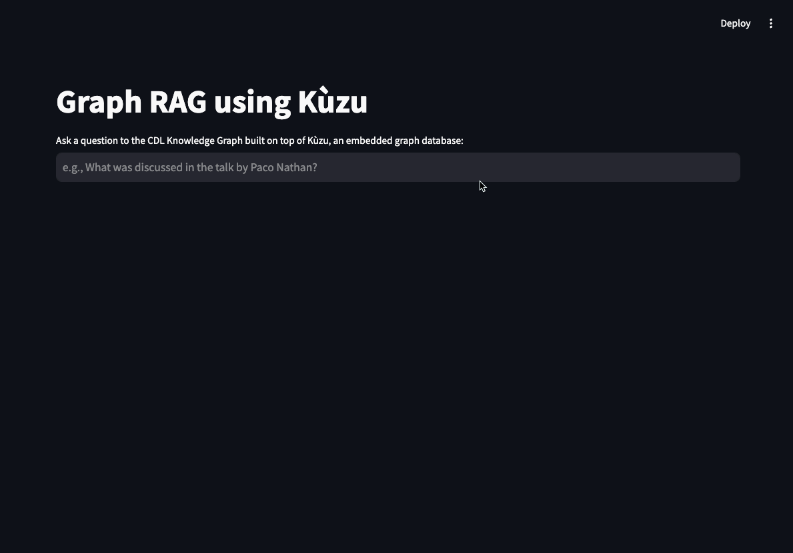

# Construct and query the Knowledge Graph using Kuzu

This directory contains the code used to construct and query the Knowledge Graph using [Kùzu](https://kuzudb.com/),
an embedded, highly scalable graph database that supports the property graph data model through a convenient Cypher query language interface.

## Why Kùzu?

As a modern embedded graph database, Kùzu offers the following benefits:

- Kùzu is designed to be embedded into your application, so you can easily begin building with minimum hassles (no servers or DB admin)
- Permissively licensed (MIT license)
- **Interoperability**: Graphs are typically constructed from a variety of structured & unstructured sources. Kùzu allows you to seamlessly transform data between various formats while iterating on your graph data model
- **Structured property graph** data model, with strict types and more control over the schema
- Add a persistent graph layer to advanced Graph RAG methods for larger-than-memory graph applications
- Where many existing implementations of Graph RAG utilize NetworkX, an in-memory graph library, Kùzu can serve as a persistent backend for larger-than-memory graph applications (all graph traversals are performed on disk, so it can easily handle graphs that are too large to fit in memory)
- Kùzu seamlessly interoperates with NetworkX, so you can use NetworkX for your graph algorithms, and Kùzu for data storage
- Kùzu can also serve as a PyTorch Geometric backend for more advanced graph neural network (GNN) use cases that involve node embeddings and graph machine learning (GNNs)
- Fast! Although retrieval latency is typically a small fraction of overall RAG application latency, Kùzu is designed to be performant and can handle large (1B node/edge) graphs, so you can move from PoC to production without worries.

## Setup

Set up a virtual environment and install the dependencies:

```bash
python -m venv .venv
source .venv/bin/activate
pip install -r requirements.txt
```

## Run the code

The scripts have been numbered sequentially, so they can be run in order.

```bash
python 00_extract_transcripts.py
python 01_extract_tag_keywords.py
python 02_domain_graph.py
python 03_content_graph.py
python rag
```

### Extract transcripts

The `00_extract_transcripts.py` script extracts the transcripts from the `.srt` subtitle script files
in the `Transcripts` directory at the root of the repository.

```bash
python 00_extract_transcripts.py
```

This will output each transcript file in `.txt` format in the `data` directory.

### 1. Extract tags

The `01_extract_tag_keywords.py` script extracts the tags from the transcripts using an LLM.

```bash
python 01_extract_tag_keywords.py
```

This outputs an `entities.json` file in the `data` directory, which contains tag keywords associated
with each talk's transcript. An example is shown below:

```json
[
  {
    "filename": "Graph Thinking _ Paco Nathan _ Connected Data World 2021.txt",
    "entities": {
      "tag": [
        "pydata",
        "rdf",
        "spark",
        "dask",
        "ray",
      ]
    }
  }
]
```

### 2. Construct the domain graph

A "domain graph" is a top-level graph that captures the relationships between speakers, talks, events, and categories. The data for
this graph comes from real-world data curation and human knowledge.

```bash
python 02_domain_graph.py
```

This will create the domain graph and store it in a Kùzu database. The database is at the `cdl_db` directory.

### 3. Construct the content graph

The content graph is a subgraph that attaches to the domain graph and captures the relationships between speakers and what tag
keywords they discuss in their talks. It utilizes the data from the `entities.json` file generated by the `01_extract_tag_keywords.py` script.

The content graph is also sometimes known as a "lexical graph", because it captures
the lexical relationships between entities in the transcripts' text. In general, the lexical graph
captures the relationships between entities inside the actual data (unlike the domain graph,
which is more abstract and captures relationships between higher-level concepts at the domain level).

```bash
python 03_content_graph.py
```

### 4. Query the graph and run Graph RAG

We are now ready to query the graph and run Graph RAG! This is done in the `rag` script. We use
an LLM to translate the given natural language questions into Kùzu Cypher queries, following which
the retrieved results are passed as context to an LLM to answer the questions in natural language.

```bash
python rag
```

Feel free to modify the prompts in the script and to experiment with different data models to
answer a broader variety of questions!

### 5. Run the Streamlit app

A simple Streamlit app is provided to easily interact with the graph through a chat interface. You
can also see the Cypher queries generated for each question.

```bash
streamlit run app.py
```

Any prior questions and answers are saved in the chat history, so you can refer back to them.



## Visualization

Graph visualization is a great method to understand the structure and the "connectedness" of your data.
We will be visualizing graphs in Kùzu using its browser-based UI,
[Kùzu Explorer](https://docs.kuzudb.com/visualization/). Docker is required to run Kùzu Explorer.
You can run the latest version of Kùzu Explorer by pulling the image from DockerHub provided using
the provided `docker-compose.yml` file.

Run the following command in this directory that uses the provided `docker-compose.yml`:

```bash
docker compose up
```

Alternatively, you can type in the following command in your terminal:

```bash
docker run -p 8000:8000 \
           -v ./cdl_db:/database
           -e MODE=READ_WRITE \
           --rm kuzudb/explorer:0.7.0
```

This will download and run the required Kùzu Explorer image, and you can access the UI at `http://localhost:8000`.

Enter the following Cypher query in the shell editor to visualize the graph:

```cypher
MATCH (a)-[b]->(c)
RETURN *
LIMIT 100
```

You can write custom Cypher queries to explore the graph in more detail.

## Next steps

The given workflow is a starting point for Graph RAG applications. From here, you can try the following:

- Use a different LLM for the tag keyword extraction
- Extract more kinds of entities (e.g. people, places, organizations) from the transcripts
- Use a different LLM for Text2Cypher
- Add more metadata to the domain graph to answer more complex questions

It's also worth **adding vector embeddings** as node properties in the graph in order to run semantic
search, which can then be combined with graph traversal in various ways to answer a broader variety of questions.
We will be publishing more material on this, so stay tuned!
